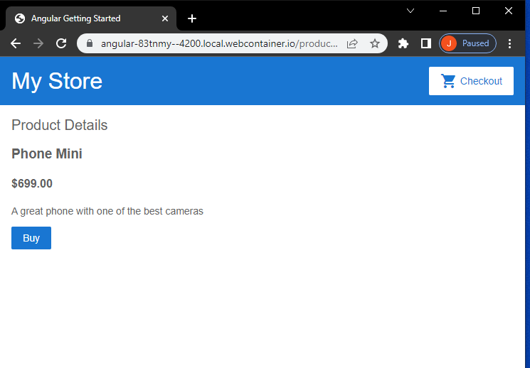

https://angular.io/start
angular-83tnmy
[Edit on StackBlitz ⚡️](https://stackblitz.com/edit/angular-83tnmy)

Angular uses TypeScript and components for building scalable web applications.
Typescript is the better version of Javascript, the interactive scripting language.
Components are parts of a framework, template, or whole that work together to make an application.

This is an introductory website using Angular and featuring mobile phones. Components interact with one another and import pre-written features. Data is easy to find, change, maintain, and deploy.

